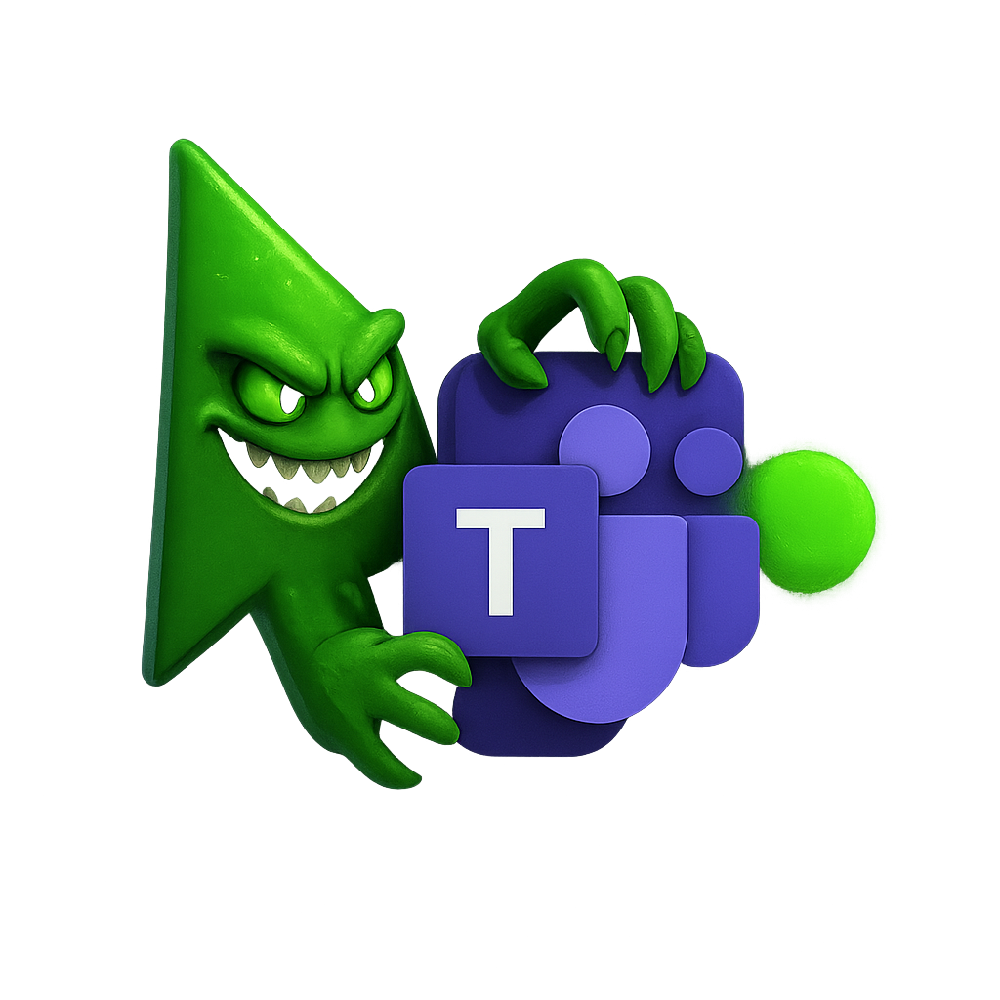

<h1 align="center">KeepTeamsGreen</h1>

  Mantieni sempre attivo lo stato <b>verde</b> nelle tue piattaforme di collaborazione, in modo elegante e discreto.

  

**KeepTeamsGreen** è un applicativo open-source per sistemi **Windows** pensato per mantenere attivo lo stato di disponibilità (“verde”) su **qualsiasi piattaforma di collaborazione**.  
Ad esempio, in applicazioni come Microsoft Teams, Slack, Zoom e simili, l’utente può risultare **"Assente"** (giallo) dopo alcuni minuti di inattività apparente, anche quando in realtà è operativo in altre attività non rilevate (riunioni telefoniche, lettura documenti, riflessioni, ecc.).

Con KeepTeamsGreen, questo problema viene risolto in modo **elegante, discreto e configurabile**.  
L’applicativo rileva l’inattività dell’utente e, se necessario, genera micro-movimenti del cursore per mantenere lo stato sempre “attivo” senza richiedere interventi manuali.

---

## ⚠️ **Disclaimer legale**
Questo progetto è **completamente indipendente** e **non affiliato** a Microsoft, Slack, Zoom o qualsiasi altra piattaforma di collaborazione.  
**Microsoft Teams** e i relativi loghi sono marchi registrati di Microsoft Corporation.  
L’utilizzo del termine “Teams” nel nome del progetto è puramente descrittivo (significa “squadre” in inglese) e non implica alcuna affiliazione o sponsorizzazione.

---

## 🚀 **Principio di funzionamento**
Il programma monitora il tempo di inattività dell’utente (assenza di input da tastiera o mouse):

- ⏱️ **Soglia di inattività** → tempo massimo senza input prima dell’intervento automatico.
- 🖱️ **Auto-jitter** → se superata la soglia, vengono eseguiti micro-movimenti del cursore.
- 🎭 **Modalità stealth** → i movimenti sono impercettibili e il cursore torna sempre alla posizione iniziale.
- 👁️ **Modalità visibile** → i movimenti risultano lievemente percepibili per l’occhio umano.

---

## 🖥️ **Interfaccia grafica (GUI)**
All’avvio, l’utente dispone di un **pannello di controllo** intuitivo, dal quale può personalizzare ogni aspetto del programma.

### Funzionalità principali:
- **Soglia di inattività (secondi)** → decide dopo quanti secondi iniziare l’intervento.
- **Intervallo jitter (secondi)** → tempo casuale tra un micro-movimento e l’altro.
- **Ampiezza jitter (pixel)** → distanza massima dello spostamento.
- **Avvio minimizzato su tray** → esegue l’app in background senza ingombrare la schermata.
- **Pulsanti di controllo** → Start, Stop, Salva impostazioni.
- **Sezione di stato** → mostra in tempo reale il funzionamento e l’orario del prossimo intervento.

---

## 🟢 **Integrazione con il tray di sistema**
L’applicativo funziona in background posizionandosi nell’area di notifica di Windows:

- Un’icona segnala che KeepTeamsGreen è **attivo**.
- Con doppio clic → riapri il pannello di controllo.
- Con tasto destro → comandi rapidi: **Apri pannello, Start, Stop, Esci**.

---

## 🛠️ **Modalità operative**
- **Idle Monitoring** → rilevamento preciso del tempo di inattività tramite API native di Windows.
- **Auto-Jitter** → micro-movimenti del cursore per evitare lo stato “assente”.
- **Visible vs Stealth** → scegli se vedere i movimenti o mantenerli invisibili.

---

## 🌟 **Vantaggi principali**
- **Continuità di stato** → resti sempre “verde” sulle piattaforme di collaborazione.
- **Personalizzazione totale** → puoi adattare ogni parametro alle tue esigenze.
- **Discrezione assoluta** → modalità tray e movimenti impercettibili.
- **Flessibilità** → utile non solo per Teams, ma anche per Zoom, Slack, Meet e altre piattaforme.
- **Open Source & Sicuro** → il codice è pubblico e verificabile.

---

## 🔧 **Modalità d’uso consigliata**
1. Avvia il programma.  
2. Configura soglia, intervalli e modalità preferite.  
3. Salva le impostazioni.  
4. Premi **Start**.  
5. *(Opzionale)* Attiva **avvio minimizzato su tray** per un’esperienza ancora più discreta.  
6. Mantieni il focus sulla finestra della piattaforma di collaborazione.

---

## 🧩 **Compatibilità**
- **Sistema operativo** → Windows 10, 11  
- **Architetture supportate** → x64 / ARM64  
- **Dipendenze** → nessuna, eseguibile standalone

---

## 📜 Licenza
Questo progetto è distribuito sotto licenza **Apache 2.0**.  
Sentiti libero di usarlo, modificarlo e condividerlo, nel rispetto dei termini di licenza.
